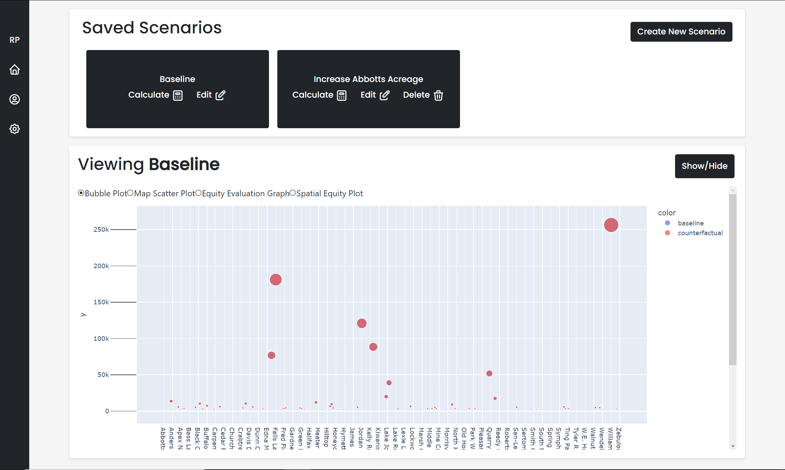
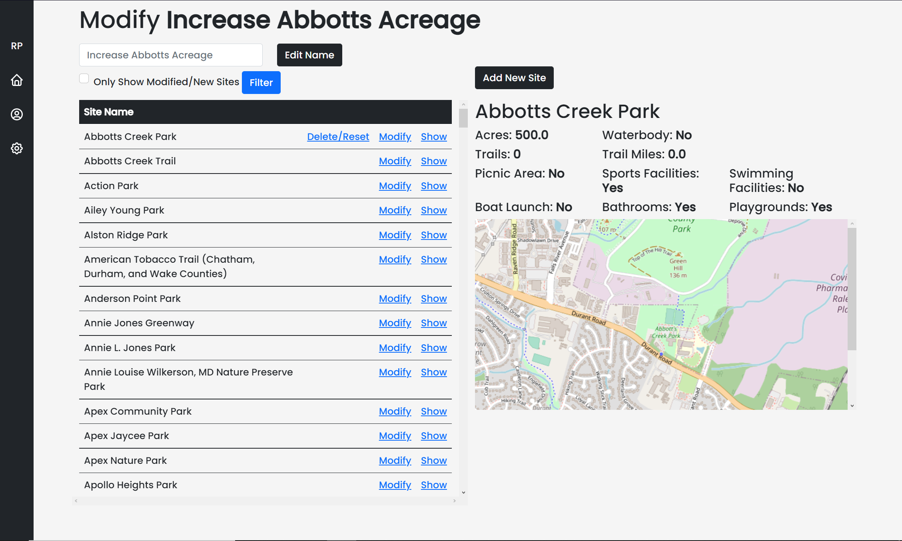
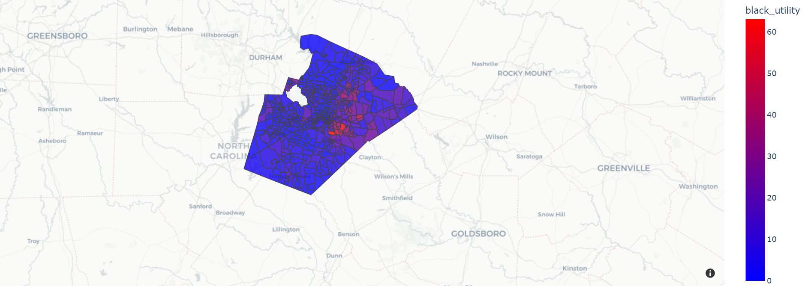
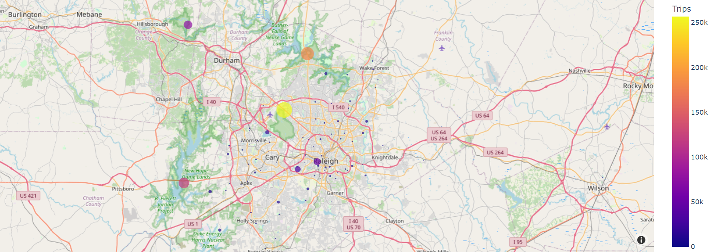

# RecPlan

RecPlan is a recreation planning tool that makes data-driven decisions easily available. 

[RecPlan Demo](https://recplan.herokuapp.com)

* Modify park site characteristics and see changes in their estimated trips
* Compare different scenarios of site characteristics with geospatial analysis tools
* Evaluate equity distribution
* Utilize accurate and precise survey data through a simple interface

# Installation and Setup
1. Download the latest version of Python from https://www.python.org/downloads/
2. Install dependencies by running `pip install -r requirements.txt` in terminal or command line
3. Start Django server on local machine by running `python manage.py runserver` in the top-level `veritas` folder

# Usage
### Home Dashboard
* Add new scenarios
* Calculate previous scenarios with one-click
* Toggle between different types of analysis views
  

### Site Modification
* Modify characteristics of a site such as its acreage, trails, or amenities
  

### Analysis Views
* View potential recreation scenarios and analyze their equity distribution along with their estimated park site visits
  

